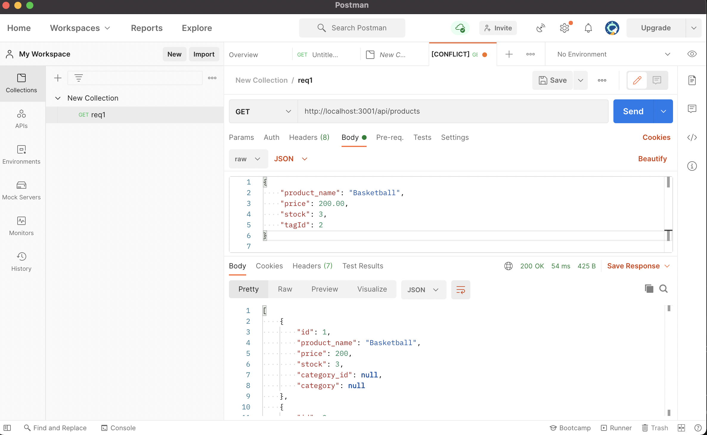

# eCommerceBackEnd

License for this app is : MIT

# Table of Contents

- [Description](#description)
- [Installation](#installation)
- [Demo](#demo)
- [License](#license)
- [Questions](#questions)

## Description:
    This back-end application has the full CRUD operations that allow user to post, update, delete product, tags, and categories using postman

## Installation:
    express, sequelize

## Demo:

## License:
    For information about the license, click the link below.

- [License](https://opensource.org/license/random)

## Questions:
    Contact me at the following Link:

-[GitHub Profile](https://github.com/omartdh)

    Send me an email at: omartdh@gmail.com